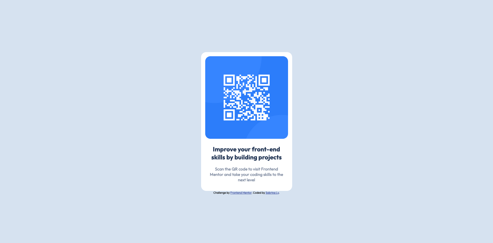

# Frontend Mentor - QR code component solution

This is a solution to the [QR code component challenge on Frontend Mentor](https://www.frontendmentor.io/challenges/qr-code-component-iux_sIO_H). Frontend Mentor challenges help you improve your coding skills by building realistic projects.

## Table of contents

- [Overview](#overview)
  - [Screenshot](#screenshot)
  - [Links](#links)
- [My process](#my-process)
  - [Built with](#built-with)
  - [Continued development](#continued-development)

## Overview

A QR Card that users can scan to visit FrontEnd Mentor website. In this project, responsive design was the main goal of completion. The general shape of the card should be kept in desktop and mobile verisons.

### Screenshot

### Links

- Solution URL: [GitHub](https://github.com/LySabrina/QR-Code)
- Live Site URL: [Live Site](https://lysabrina.github.io/QR-Code/)

## My process

To design this card, set up a container that encapsulate two additional containers. The inner-containers compromised of the image and text container.

### Built with

- Semantic HTML5 markup
- CSS custom properties
- Flexbox
- Mobile-first workflow
